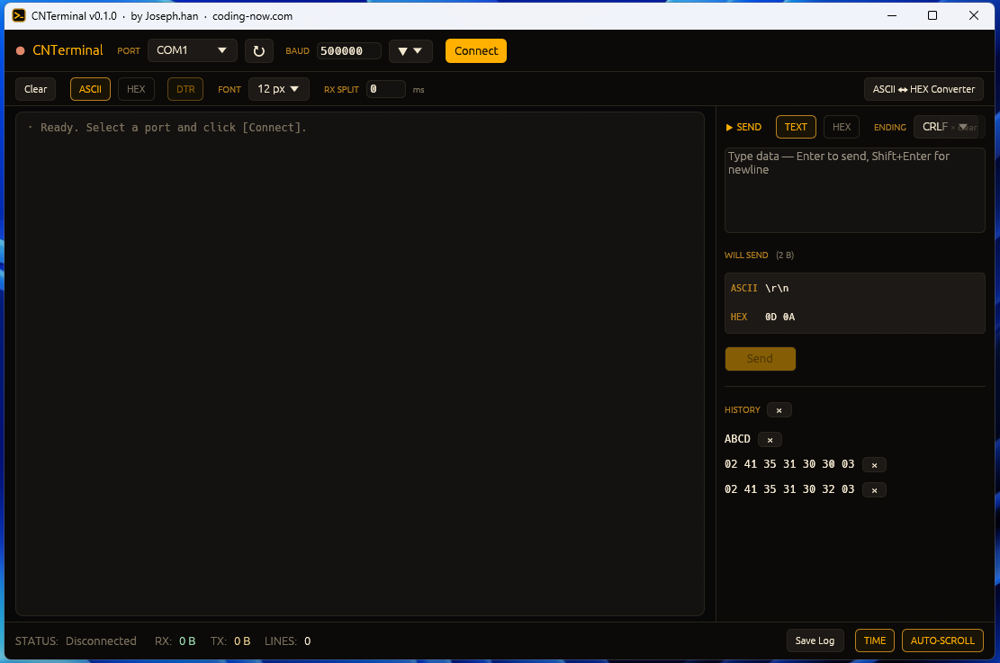

# CNTerminal — A No-Install Portable Serial Terminal



> **TL;DR**: Download → double-click → done. One ~8 MB `.exe` does serial
> monitoring, HEX send/receive, and ASCII↔HEX conversion. No installer,
> no runtime, no admin rights.

If you've ever fought with PuTTY's settings every single time, or run into
the Arduino IDE's serial monitor hitting its limits while debugging an
embedded device — **CNTerminal** is built for that exact moment. Drop it on
a USB stick or a shared folder; anyone can run it with a double-click.

- 💾 **Download**: [CNTerminal_v0.1.0.exe](https://github.com/cflab2017/tool_serial_terminal_Rust/releases/latest)
- 📂 **Source**: [GitHub](https://github.com/cflab2017/tool_serial_terminal_Rust)
- 🎮 **Live demo**: [demo.html](./demo.html) (runs in any browser)

---

## 1. Install (well, sort of)

1. Grab `CNTerminal_v0.1.0.exe` from the [Releases page](https://github.com/cflab2017/tool_serial_terminal_Rust/releases)
2. Put it anywhere and double-click
3. That's it

On first launch Windows SmartScreen may warn you — pick **More info → Run anyway**
(the .exe isn't code-signed; the full source is public, so you can also build
it yourself if that bothers you).

Windows usually auto-installs USB-serial chipset drivers (CH340 / CP210x /
FTDI / etc). If your port doesn't show up, install the vendor driver first.

---

## 2. Five-Minute Walkthrough

### 2-1. Connect

1. Pick the device port from the top **PORT** dropdown (use `↻` to refresh)
2. Set **BAUD** — presets (`9600` … `921600`) are in the `▼` menu; or just
   type a non-standard value like `500000`
3. Click **Connect**

The LED on the left turns red → **green** and incoming RX data starts
streaming into the console in real time.

### 2-2. Send Data

Type a command in the multiline **▶ SEND** editor on the right and hit
**Enter**.

- `Enter` → send immediately
- `Shift+Enter` → newline (multiline input)
- `ENDING` dropdown picks the line terminator (`None` / `LF` / `CR` / `CRLF`)
- The input **does not clear** after sending — just press Enter again to
  repeat the same command
- Use the `× clear` button next to the SEND header to clear manually

### 2-3. See Exactly What Goes On the Wire

Right under the input, the **WILL SEND** preview updates live:

```
WILL SEND   (5 B)
ASCII  A00\r\n
HEX    41 30 30 0D 0A
```

It always shows **both** ASCII (with escapes) and HEX. The ENDING is included.
This lets you catch send-side mistakes *before* you actually press Enter.

---

## 3. Common Scenarios

### Scenario ①: Arduino Serial Monitor

```
BAUD     115200
ENDING   LF
MODE     TEXT
```

Calls like `Serial.println("temp=25.3")` appear as one line each, with
auto-timestamps. Toggle **AUTO-SCROLL** to follow the tail; click **Save Log**
to save the whole session as `.txt`.

### Scenario ②: HEX Protocol Debugging (STX/ETX, checksums)

Industrial sensors and PLCs often send binary frames wrapped in `0x02 ... 0x03`
(STX/ETX). A plain ASCII monitor shows nothing but garbage glyphs.

**With CNTerminal**:

1. Toggle the **HEX** button on the second toolbar — the console flips to
   hex-dump view
2. Set **RX SPLIT** to `2` — after 2 ms of silence the line is force-split
   (HEX mode lacks `\n` separators, so without this a single line grows
   forever)
3. Switch the send panel to **HEX** mode — type `02 41 35 30 30 03` and
   raw bytes go out (your ENDING is appended automatically)

### Scenario ③: Stop ESP32 From Auto-Resetting

Many ESP32/Arduino boards are wired so that DTR transitions reset the chip.
To stop the board from resetting while you're debugging:

1. Connect, then click the **DTR** toggle on the second toolbar — it turns
   gray (OFF)
2. The DTR line stays put across connect/disconnect cycles, so the board
   doesn't reset

---

## 4. ASCII ↔ HEX Converter

Click **`ASCII ↔ HEX Converter`** on the right of the second toolbar to
open a popup. Type in either box and the other auto-fills:

| Input | Result |
|-------|--------|
| ASCII: `\x02A50000\x03` | HEX: `02 41 35 30 30 30 30 03` (8 B) |
| ASCII: `Hello\nWorld` | HEX: `48 65 6C 6C 6F 0A 57 6F 72 6C 64` |
| HEX: `02 41 35 30 30 03` | ASCII: `\x02A500\x03` |

**Key bit**: non-printable bytes show up as `\xNN`, so round-trips are
exact. Great for inspecting STX/ETX-wrapped frames.

The `→ Send box (TEXT/HEX)` buttons load the conversion result straight
into the send editor and switch to the matching mode.

---

## 5. Settings Auto-Saved (and Still Portable)

Every setting you change — port, baud, font size, send history, your
custom bauds — is auto-saved to **`cnterminal.cfg`** right next to the `.exe`:

```text
# Serial Terminal config (auto-saved)
baud=500000
port=COM3
display_mode=ascii
font_size=13
custom_baud=500000
history=AT
history=status
```

Carry the `.exe` + `cnterminal.cfg` on a USB stick — same environment
everywhere.

---

## 6. Cheatsheet

| Where | Action |
|-------|--------|
| Send box: `Enter` | Send now |
| Send box: `Shift+Enter` | Insert newline |
| Toolbar 2: `Clear` | Clear console |
| Toolbar 2: `ASCII / HEX` | Switch console display (raw kept, re-rendered) |
| Toolbar 2: `DTR` | Toggle DTR line |
| Toolbar 2: `FONT [13 px ▼]` | Console font size |
| Toolbar 2: `RX SPLIT [n] ms` | Force-split RX line after n ms idle (0 = off) |
| Footer: `Save Log` | Save console output to .txt |
| Footer: `TIME` | Toggle timestamps |
| Footer: `AUTO-SCROLL` | Toggle auto-scroll |

---

## 7. Live Demo

Here's an interactive demo you can embed straight in your blog post — it
runs a fake device, no real USB serial required:

```html
<iframe src="./demo.html"
        width="100%" height="640"
        style="border:1px solid #2a251e;border-radius:6px"
        title="CNTerminal demo"></iframe>
```

→ **[Open the demo](./demo.html)**

Things to try:

- Press `Connect` → a fake sensor stream starts
- Type `AT`, `status`, `help`, or anything → press Enter
- Toggle `ASCII` / `HEX` display
- Switch `TEXT` / `HEX` send mode, change `ENDING`
- Watch the WILL SEND preview update live

---

## 8. Build It Yourself

The source is fully public. The icon is drawn procedurally in code, so
there are no missing asset files — the build is clean.

```powershell
git clone https://github.com/cflab2017/tool_serial_terminal_Rust
cd tool_serial_terminal_Rust
cargo build --release         # → target/release/cnterminal.exe
# Or a version-stamped build (for distribution)
.\scripts\build.ps1           # → target/release/CNTerminal_v0.1.0.exe
```

**Requirements**: Rust 1.92+, Windows recommended (Linux/macOS still build
cleanly). About 30 seconds to 2 minutes depending on cache state.

---

## 9. Tech Notes (for the curious)

- **GUI**: [eframe + egui](https://github.com/emilk/egui). Everything statically
  linked into a single .exe — zero external runtimes (no WebView2, no .NET, no Python)
- **Serial**: `serialport` crate (cross-platform)
- **Architecture**: UI thread and serial worker thread split by two
  `std::sync::mpsc` channels. The worker does 50 ms timed reads + 20 ms
  batching, then calls `ctx.request_repaint()` to wake the UI at exactly
  the right moment.
- **Memory protection**: console capped at 5,000 lines, auto-trimmed
- **Theme**: dark amber CRT (#0b0a08 bg / #ffb000 accent), deliberately
  avoiding overdone retro effects (no CSS scanlines etc.)

Code: [src/main.rs](https://github.com/cflab2017/tool_serial_terminal_Rust/blob/main/src/main.rs)

---

## Closing Note

What I cared about most while building this was *"everything visible the
moment you open it."* Toggles buried in settings menus, shortcuts you only
discover from a manual, env vars, separate installers — strip all of that
away and leave the actual serial terminal on one screen.

Feedback, issues, and PRs welcome.
([GitHub Issues](https://github.com/cflab2017/tool_serial_terminal_Rust/issues))

— **Joseph.han** · [coding-now.com](https://coding-now.com)
